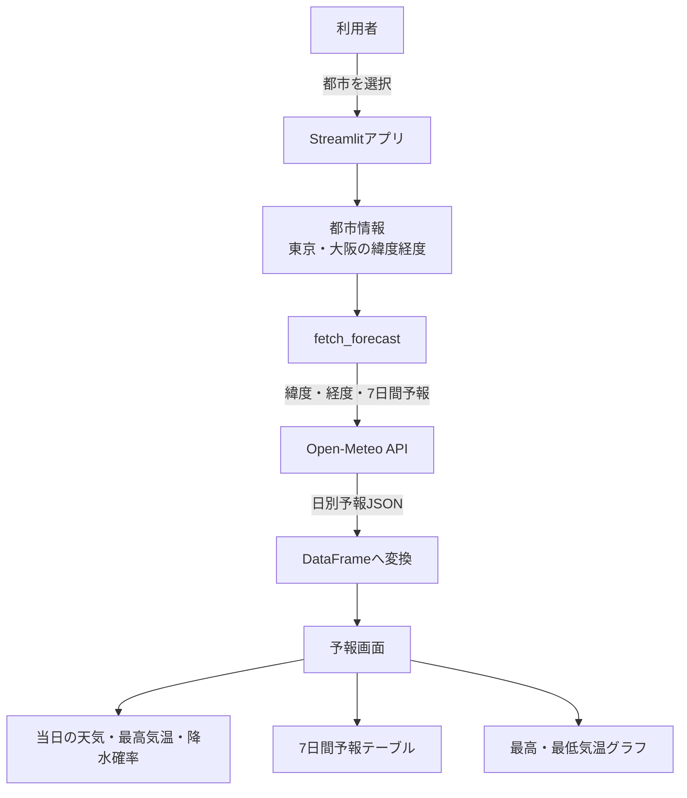
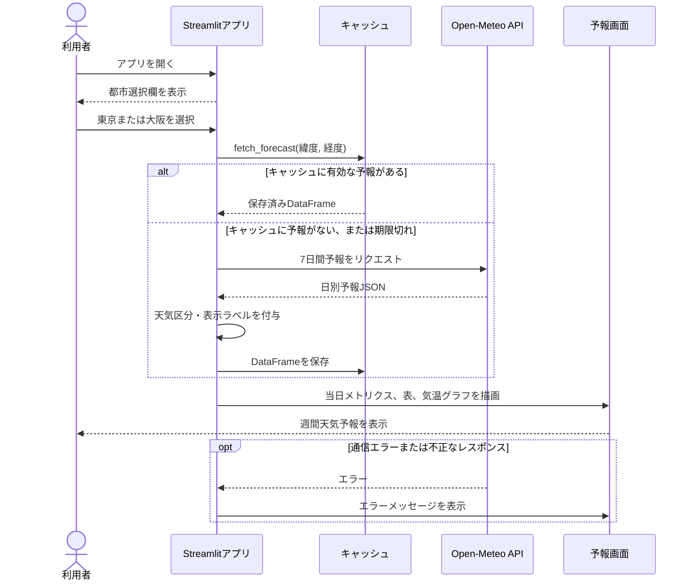

## 概要図

```mermaid
flowchart TB
	User[利用者] -->|都市を選択| Streamlit[Streamlitアプリ]
	Streamlit --> Location[都市情報<br/>東京・大阪の緯度経度]
	Location --> Forecast[fetch_forecast]
	Forecast -->|緯度・経度・7日間予報| API[Open-Meteo API]
	API -->|日別予報JSON| DataFrame[DataFrameへ変換]
	DataFrame --> Dashboard[予報画面]
	Dashboard --> Today[当日の天気・最高気温・降水確率]
	Dashboard --> Table[7日間予報テーブル]
	Dashboard --> Chart[最高・最低気温グラフ]

```

## シーケンス図

```mermaid
sequenceDiagram
	actor User as 利用者
	participant App as Streamlitアプリ
	participant Cache as キャッシュ
	participant API as Open-Meteo API
	participant View as 予報画面

	User->>App: アプリを開く
	App-->>User: 都市選択欄を表示
	User->>App: 東京または大阪を選択
	App->>Cache: fetch_forecast(緯度, 経度)
	alt キャッシュに有効な予報がある
		Cache-->>App: 保存済みDataFrame
	else キャッシュに予報がない、または期限切れ
		App->>API: 7日間予報をリクエスト
		API-->>App: 日別予報JSON
		App->>App: 天気区分・表示ラベルを付与
		App->>Cache: DataFrameを保存
	end
	App->>View: 当日メトリクス、表、気温グラフを描画
	View-->>User: 週間天気予報を表示

	opt 通信エラーまたは不正なレスポンス
		API-->>App: エラー
		App->>View: エラーメッセージを表示
	end

```